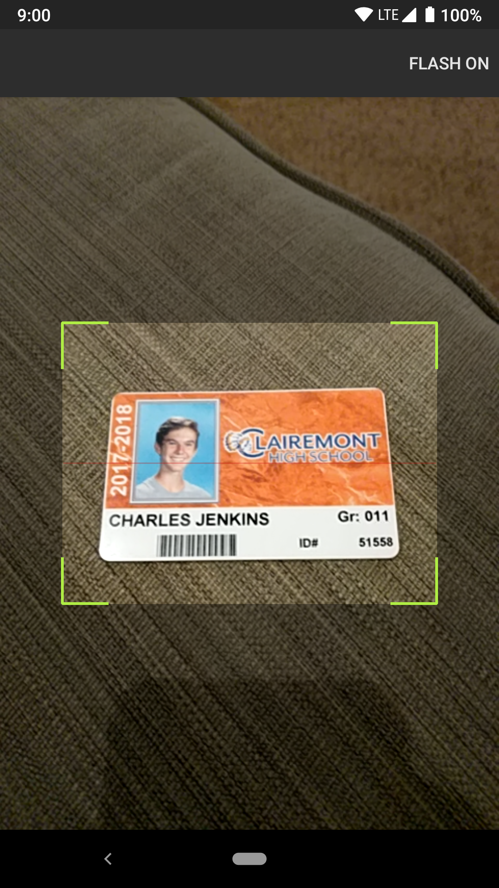
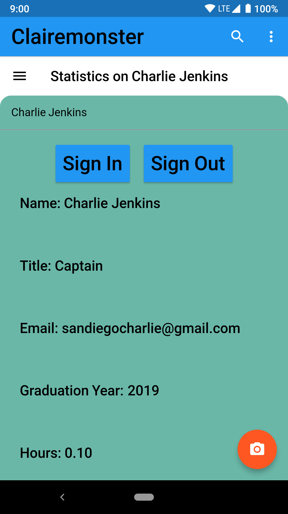
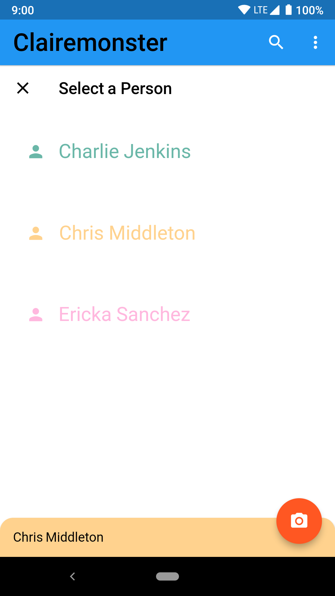

# Sign In Application

Originally created as a sign-in application for FRC #5474, but can be generalized to signing in for anything.

Features include:
- 
- Sign in/ create a user by scanning a barcode containing some string or numbers
- Search for users
- Splash Screen with logo
- Adjustable fields to store.
- Keeps track of amount of time user is signed in
- All information stored on Firebase so is syncronized in realtime across any number of devices.

## Getting Started

For help getting started with Flutter, view our online
[documentation](https://flutter.io/).
